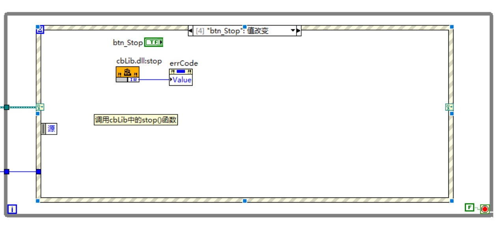

# LabVIEW与C的混合开发 -- 1、优雅地使用C共享库(DLL)中的回调函数

## 前言

众所周知，LabVIEW中无法直接传递或使用C共享库(DLL)中的函数指针，这就导致了有些需要通过传入回调函数指针作为回调函数的函数无法使用。常规的解决办法有两个，一是用C写一个包装库(wrap)，在包装库中构建一个回调函数并获取函数指针传入。回调函数中获取到的数据通过全局变量来保存，再导出一个读全局变量的函数，供LabVIEW使用。而LabVIEW中通过while循环来不断轮询该函数，以获取到回调函数中得到的数据。该办法解决了回调函数的问题，但数据传递上采用轮询机制，有可能出现漏读、重复读取等现象，还需要靠各种标志位来保证数据实时和有效。而另一个办法则是通过C#对C共享库进行封装，通过委托，并公开一个event事件，这样LabVIEW中就可以通过.NET选板中的事件回调注册，创建一个回调VI，获取到回调数据。该办法同时解决了回调函数和数据主动传递的问题，但引入了.NET，如果数据量大还涉及到托管内存和非托管内存的转换，效率会有一定的影响。

本文在第一种办法的基础上，优化数据传递方式，通过LabVIEW的UserEventRef用户事件直接向LabVIEW主动传递数据，无需进行轮询读取，也无额外的内存和资源开销。

下文将构建一个简易的C共享库(DLL)，一步一步地详细阐述该方法。

## 1. 测试C共享库(DLL)

首先我们构建一个用来测试的C共享库，其头文件如下：

```c
/**
 * @brief 回调函数，循环间隔时间调用
 * @param randomNum 随机数
 */
typedef void (*cbFunc)(int32_t randomNum);
```

```c
/**
 * @brief 开始运行，调用函数时传入一个回调函数，调用后自动定期地调用回调函数，
 * 并在回调函数的randomNum中返回一个随机数
 * @param callback 回调函数指针
 * @param interval_ms 调用回调函数的间隔时间，单位为毫秒
 * @return 0 if successful, -1 if failed
 */
MYLIBRARY_API int32_t start(cbFunc callback,  uint32_t interval_ms);

/**
 * @brief 停止运行，调用函数后停止运行，不再调用回调函数
 * @return 0 if successful, -1 if failed
 */
MYLIBRARY_API int32_t stop();
```

该共享库导出了两个函数，start()和stop()，并提供了回调函数的原型，调用start()时需传入构建的回调函数和回调函数调用的间隔时间，调用成功后共享库会创建一个线程，并按间隔时间定期生成一个随机数，并通过调用回调函数传入该随机数。调用stop()后停止并回收线程。

我们先看一下如果使用C语言来开发程序，应该如何使用该共享库。

```c
void myCallback(int32_t randomNum) {  // 构建回调函数，获取传入的randomNum
    printf("Recv Random Value: %d\n", randomNum);
}
```

```c
if (start(myCallback, 100) == 0) {   // 调用Start，传入回调函数指针和时间间隔100ms
    printf("Thread Start Success\n");
    Sleep(3000);                    // 休眠3s，等待回调函数执行
    if (stop() == 0) {               // 调用Stop，停止回调执行
        printf("Thread Stop Success\n");
    } else {
        printf("Thread Stop Fail\n");
    }
} else {
    printf("Thread Start Fail\n");
}
```

其运行过程如下：


## 2. 编写C包装库(LvWrap)

首先需要知道LabVIEW自带了供C调用的工具库，其路径在LabVIEW的安装目录下的cintools中，我们这里以`C:\Program Files (x86)\National Instruments\LabVIEW 2015\cintools`为例。

接下来我们开始编写LvWrap库，并采用CMake进行项目管理，首先创建CMakeLists.txt文件，并把LabVIEW的cintools中的头文件包含进去，同时连接其静态库。

```cmake
cmake_minimum_required(VERSION 3.24)
project(LvWrap C)

set(CMAKE_C_STANDARD 11)

set(LIBRARY_OUTPUT_PATH ${PROJECT_SOURCE_DIR}/build)

include_directories("C:/Program Files (x86)/National Instruments/LabVIEW 2015/cintools")

add_library(LvWrap SHARED library.c)

target_link_libraries(LvWrap "C:/Program Files (x86)/National Instruments/LabVIEW 2015/cintools/labviewv.lib")
```

接下来创建头文件library.h，并包含LabVIEW工具库的头文件`extcode.h`

```c
#ifndef INC_02_LVWRAP_LIBRARY_H
#define INC_02_LVWRAP_LIBRARY_H

#include "extcode.h"

#define LVWRAP_API __declspec(dllexport)

/**
 * @brief 定义回调函数原型，需与共享库的回调函数原型一致
 * @param randomNum 随机数
 */
typedef void (*cbFunc)(int32_t randomNum);

/**
 * @brief 传入LabVIEW的用户事件引用，并返回创建的回调函数指针。
 * 这里传入两种格式的用户事件引用以作测试
 * @param eventRef_uint8arr 用户事件引用，其数据格式为Uint8数组。
 * @param eventRef_int32val 用户事件引用，其数据格式为Int32数值。
 * @return 回调函数指针。
 */
LVWRAP_API cbFunc getFuncPtr(LVUserEventRef *eventRef_uint8arr, LVUserEventRef *eventRef_int32val);

#endif //INC_02_LVWRAP_LIBRARY_H
```

然后创建C程序文件library.c，并包含library .h及必要的C库头文件。(以下仅给出主要代码，完整代码请见文末连接)

```c
#include "library.h"
#include <stdio.h>
#include <windows.h>

#define DOUBLE_SIZE sizeof(double)
#define INT32_SIZE sizeof(int32_t)

static cbFunc callback_func = NULL;
static LVUserEventRef *event_ref_uint8arr = NULL;
static LVUserEventRef *event_ref_int32val = NULL;

void callbackFunc(int32_t randomNum) {
    char timeStr[30];
    double seconds;
    // 获取当前时间并转成LabVIEW时间格式和时间字符串
    getLabVIEWTime(&seconds, timeStr, sizeof(timeStr));            

    if (event_ref_uint8arr != NULL && event_ref_int32val != NULL) {
        // 初始化输出数据数组,并将时间和随机数拷贝到数组中
        static uint8_t output[DOUBLE_SIZE + INT32_SIZE];                  
        uint8_t *ptr_time = (uint8_t *) &seconds;
        uint8_t *ptr_num = (uint8_t *) &randomNum;
        for (int i = 0; i < INT32_SIZE; i++) {
            output[i] = ptr_num[i];
        }
        for (int i = 0; i < DOUBLE_SIZE; i++) {
            output[i + INT32_SIZE] = ptr_time[i];
        }
        // 创建labview事件数据句柄
        LStrHandle lvDataHandle = (LStrHandle) DSNewHandle(
            sizeof(int32) + (DOUBLE_SIZE + INT32_SIZE) * sizeof(uChar)); 

        // 初始化labview事件数据句柄
        memset(LStrBuf(*lvDataHandle), '\0',DOUBLE_SIZE + INT32_SIZE);  

        // 将输出数据数组拷贝到labview事件数据句柄中
        for (int i = 0; i < DOUBLE_SIZE + INT32_SIZE; i++) {                  
            LStrBuf(*lvDataHandle)[i] = (uChar) output[i];
        }

        // 设置labview事件数据长度
        LStrLen(*lvDataHandle) = DOUBLE_SIZE + INT32_SIZE;         

        // 产生用户事件（传递到LabVIEW），数据类型是数组、字符串等需传入事件数据句柄地址。
        int32_t lvErr_uint8arr = PostLVUserEvent(*event_ref_uint8arr, &lvDataHandle);

        // 产生用户事件（传递到LabVIEW），数据类型是基本值类型，则只需传入值的地址。
        int32_t lvErr_int32val = PostLVUserEvent(*event_ref_int32val, &randomNum);   

        // 记录日志
        errno_t err = fopen_s(&log_file, LOG_FILE_NAME, "a");
        if (err == 0) {
            fprintf(log_file, "[%s] callbackFunc: %3d, LVErrNum(Uint8Array): %d, LVErrNum(Int32Value): %d\n",
                    timeStr, randomNum, lvErr_uint8arr, lvErr_int32val);
            fclose(log_file);
        }
    }
}

cbFunc getFuncPtr(LVUserEventRef *eventRef_uint8arr, LVUserEventRef *eventRef_int32val) {
    // 保存用户事件引用和回调函数指针到全局变量中
    event_ref_uint8arr = eventRef_uint8arr;
    event_ref_int32val = eventRef_int32val;
    callback_func = callbackFunc;

    // 记录日志
    errno_t err = fopen_s(&log_file, LOG_FILE_NAME, "a");
    if (err == 0) {
        fprintf(log_file,
                "GET Func Ptr UserEventRef(Uint8Array): %08X, UserEventRef(Int32Value): %08X, callback: %p\n",
                *event_ref_uint8arr, *event_ref_int32val, callback_func);
        fclose(log_file);
    }

    // 返回回调函数指针
    return callback_func;
}
```

 **重点函数：**

[`PostLVUserEvent`](https://www.ni.com/docs/zh-CN/bundle/labview-api-ref/page/properties-and-methods/lv-manager/postlvuserevent.html): 产生LabVIEW用户事件，需传入两个参数：用户事件引用和用户事件数据。

[`DSNewHandle`](https://www.ni.com/docs/zh-CN/bundle/labview-api-ref/page/properties-and-methods/lv-manager/dsnewhandle.html): 创建新的数据句柄，需传入句柄的大小。

**句柄数据结构：**

```c
typedef struct {
    int32    cnt;        /* number of bytes that follow */
    uChar    str[1];        /* cnt bytes */
} LStr, *LStrPtr, **LStrHandle;
```

句柄的本质是一个可变长度的结构体，第一个成员cnt是数据的长度，第二个成员str是可变长度的字节数组，其长度需等于cnt。因此创建新的数据句柄时，需传入`sizeof(int32) + sizeof(事件数据)`。并须在创建后设定数据长度和复制事件数据。

在上述代码中可以看出，如果需要产生基本值类型（int32、float、double等）的用户事件，其用户事件数据只需要传入该值的地址即可。但如果需要产生具备连续内存的类型（数组、字符串等），则需先创建事件数据句柄并初始化，然后再将需传递的数据复制到句柄下，并设定数据长度。

上述的回调函数`callbackFunc()`中，我们实现了产生两个用户事件，第一个是基本值类型的用户事件，第二个是uint8数组用户事件，uint8数组的内容分别为：前4个字节是randomNum，后8个字节是当前时间的LabVIEW时间类型。

## 3. LabVIEW调用测试

好了，接下来把`步骤1`中的测试共享库（cbLib.dll）和`步骤2`中编写的包装库（LvWrap.dll）复制出来，编写LabVIEW调用Demo：





其中，在调用LvWrap的getFuncPtr()时传入的用户事件句柄需作以下设置：


其返回值设置如下：


调用cbLib的start()时传入的回调事件指针设置如下：


其他库函数调用按常规处理即可。

运行结果如下：


对比自动生成的日志文件，数值和时间数据的传递一致。


至此，本文实现了通过编写包装库，传递LabVIEW用户事件引用，实现了C共享库中的回调函数的自动调用并通过用户事件主动传递数据到LabVIEW中。

## 4. 所有源码连接

[LabVIEW DLL Callback](https://github.com/clan4456/Tutorial/tree/main/LabVIEW%20DLL%20Callback)

## 后记

本人的公众号已停更2年多了，具体原因除了因为之前一直在忙，没抽出时间写文章外，主要是不想写同质化的文章。群友问的很多关于LabVIEW的问题，其实直接搜一下问AI就能得出答案，就算没有LabVIEW的解决方案，参考其他语言的解决方案也能有解决方向，没必要用来水文章。撰写本文的目的是工作上需要调用含回调函数的C共享库，之前一直用的实现方式不够优雅。由于LabVIEW的编程手册过于简单，网上也没多少资料可以参考，因此一直该调用一直没什么进展。后来偶尔从LabVIEW的QT实现库源码中找到解决方向，经过一轮资料查询后，测试成功并撰写此文。
