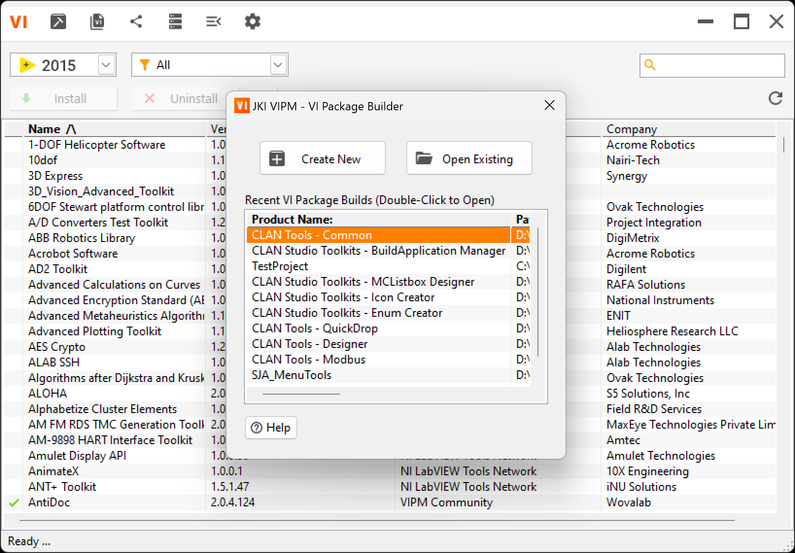
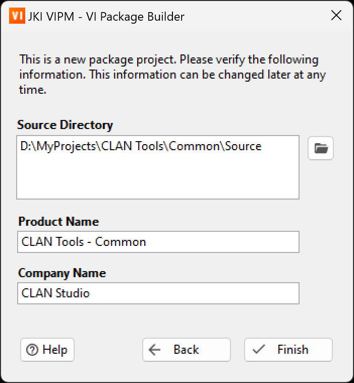
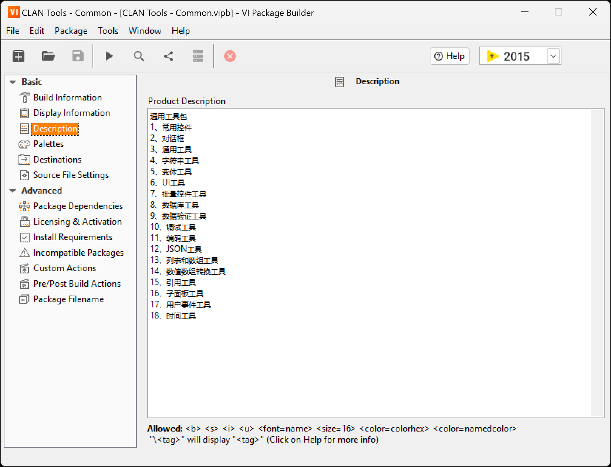
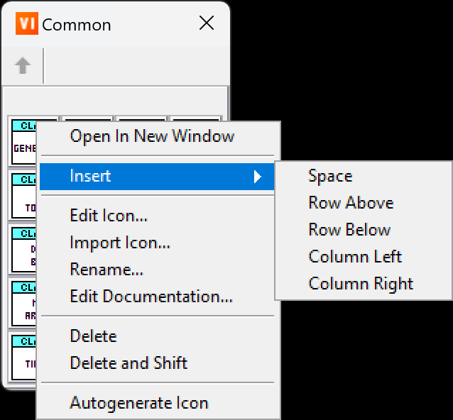
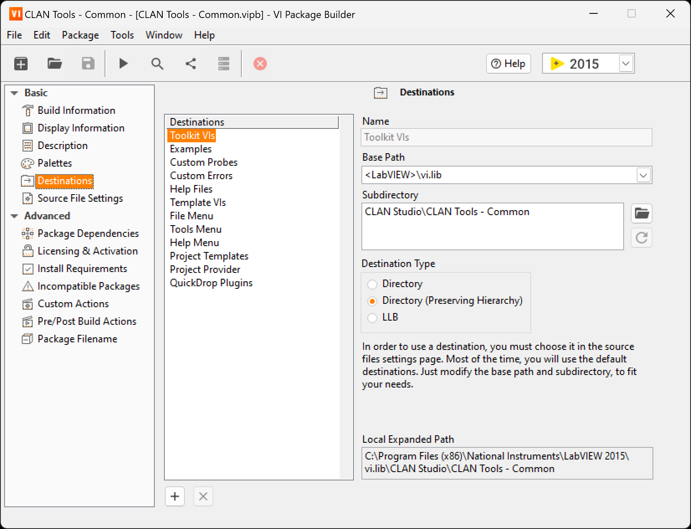
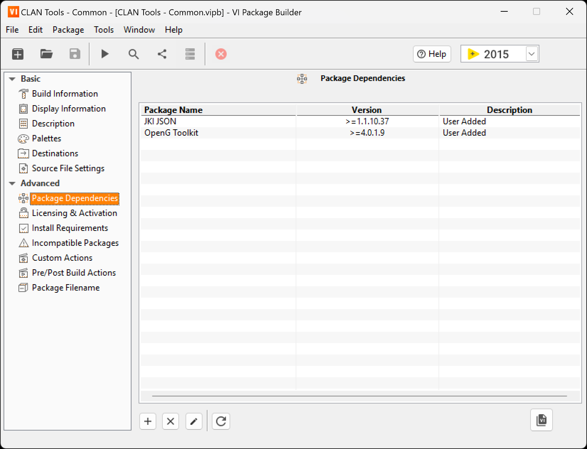
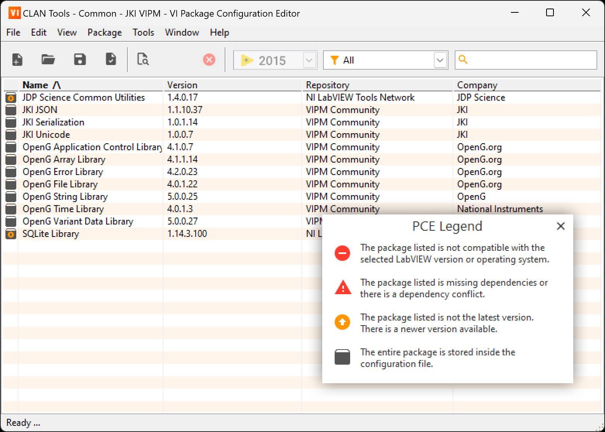
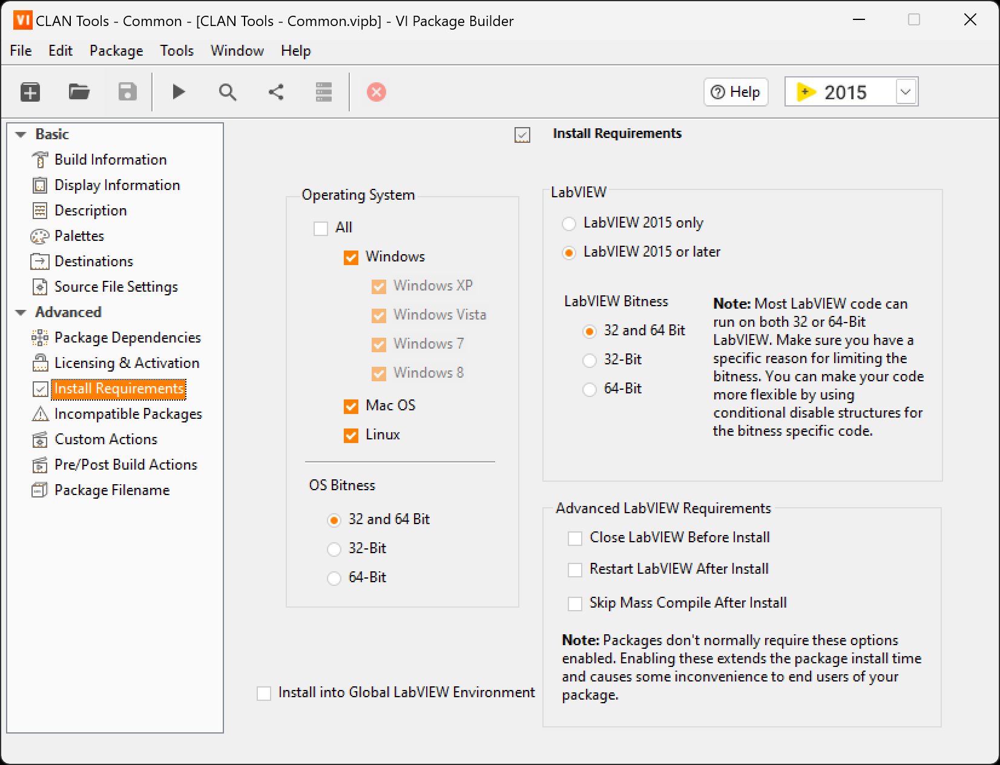
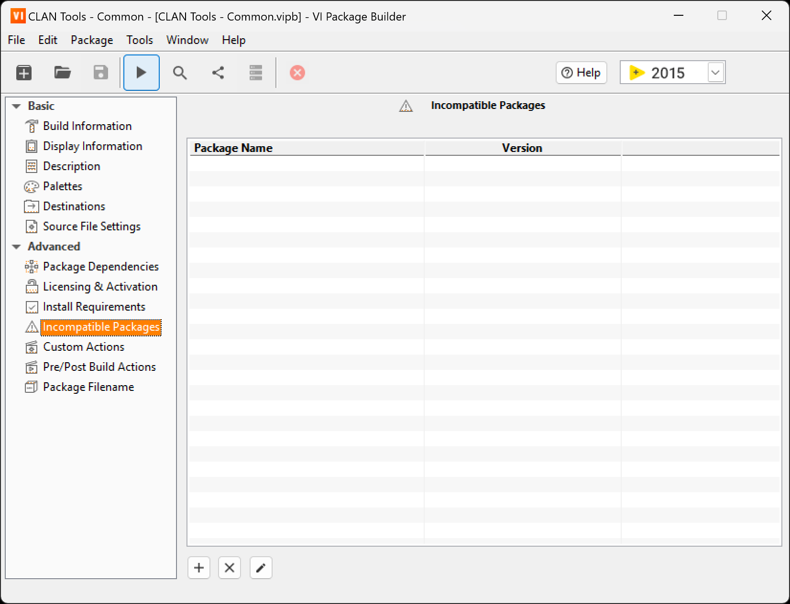
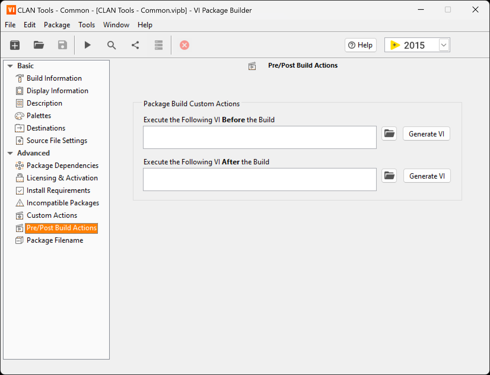

# LabVIEW VIPM 工具包打包教程

## 1.  VIPM简介

VI Package Manager（VIPM）是一个JKI组织开发的，对LabVIEW工具包进行搜索、创建、共享的包管理工具。对应LabVIEW开发工程师来说，到VIPM里搜索和安装工具包是一个必备技能，一些非常常用的工具包，如OpenG Library等都是通过VIPM进行发布和管理的。

本教程主要讲解如何利用VIPM来打包自己写的工具，以方便分享，或安装到其他电脑中进行使用。

## 2. 打开 Open VI Package Builder

通过左上角  图标，可以打开 `Open VI Package Builder` 窗口，如下图：

该界面可通过 `Create New` 按钮创建新的打包项目，也可通过 `Open Existing` 按钮打开已保存的打包项目文件（*.vipb）。同时也支持直接双击下方列表的近期项目来直接打开打包项目文件。

下面，本教程将以个人项目 `CLAN Tools - Common` 为例子，一步一步进行工具包打包操作。

## 3. CLAN Tools - Common项目打包

### 3.1. 项目结构

Common项目包含用于前面板的控件和用于后面板的函数模块，整个项目树结构如下：

### 3.2. 创建VI Package Builder项目文件

点击 `VI Package Builder` 中的 `Create New` 按钮后，如下图，填入对应的项目信息，并点击 `Finish` 按钮。

- `Source Directory` - 工具包源路径

- `Product Name` - 工具包名称

- `Company Name` - 公司/组织名称

### 3.3. 配置VI Package Builder项目文件

项目文件配置主界面：

基本配置：

- `Build Information` - 构建信息

- `Display Informtion` - 显示信息

- `Description` - 项目简介

- `Palettes` - 选板配置

- `Destinations` - 目标路径配置

- `Source File Settings` - 源文件配置

高级配置：

- `Package Dependencies` - 工具包依赖

- `Licensing & Activation` - 授权和激活

- `Install Requirements` - 安装环境要求

- `Incmpatible Packages` - 不兼容工具包配置

- `Custom Actions` - 安装/卸载的前/后操作

- `Pre/Post Build Actions` - 构建前/后操作

- `Package Filname` - 工具包文件名

#### 3.3.1. `Build Information` - 构建信息

如上图所示：

- `Source Directory` ：选择源文件目录

- `Build Output Directory` ：选择构建打包文件输出目录

- `Version Number of Next Build` ：生成的工具包版本号（构建后会自动递增，无需手动修改）

- `Release Notes / Change Log` ：发布说明/修改记录，主要是记录该版本的修改发布说明

#### 3.3.2. `Display Informtion` - 显示信息

  

如上图所示，该页面信息主要显示在工具包安装页面上。

- `Product Name` ：工具包名称

- `Product Icon` ：工具包图标，右击图标弹出菜单，可选择编辑、导入和自动生成图标。

- 其他信息：其他如公司名称、版权信息、作者名称、许可证等等

#### 3.3.3. `Description` - 项目简介

如上图所示，该页面主要填写工具包的详细介绍，支持 `<b></b>` （粗体）、`<s></s>` （删除线）、`<i></i>`（斜体） 、`<u></u>` （下划线）、`<font=[FontName]>` （设置字体）、`<size=[SizeNo]></size>` （设置字号）、`<color=[ColorName or ColorHex]></color>` （设置颜色）等富文本标签。

#### 3.3.4. `Palettes` - 选板配置

如上图所示，该页面主要用于配置前面板或程序框图的控件和函数选板。

- `Palette Set` ：选板配置，默认为Default，可根据需要建立不同的选板配置。

- `Custom Category` ：自定义类别。勾选后，该类别作为顶层一级分类置于选板中。为了方便使用和维护，建议勾选该选项。

- `Palette Defaults` ：选板默认配置。
  
  1. `Apply Short Names to VI Titles` 勾选后，将会把选板设置的Short Name作为VI Title，应用到VI中。
  
  2. `Add Palette to Library or Class` 勾选后并选择库文件或类文件后，会把该选板配置以文件形式添加到库或类中。

- `Functions Palette` & `Controls Palette` ：位于程序框图的函数选板 & 位于前面板的控件选板。如勾选了自定义类别，则该分类作为二级分类置于选板中。如不勾选自定义类别，则该分类作为一级分类至于选板中。
  
  1. 点击选板图标，可以进入下一级选板分类
  
  2. VIPM默认以源文件目录为根目录，自动按文件夹对选板进行归类。其中，以下横线 `_` 为文件名首字符的文件不作归类。（LabVIEW约定俗成，以下横线为文件名首字符的VI/CTL为私有子VI，所有菜单、选板等均不纳入归类）
  
  3. 所有vi文件放置于函数选板，所有ctl文件放置于控件选板。
  
  4. 右击文件夹图标弹出菜单，可选择修改图标、插入空格/空行/空列、重命名、修改帮助简介、删除等操作。也可通过左键拖动图标进行位置排布。如下图所示。
     
     
  
  5. 右击VI图标弹出菜单，也可通过勾选 `Place VI Contents` ，放置VI内容（直接放置程序框图中的内容），而不是直接调用VI。通过该功能可把常用的框图结构，做成模板，方便使用。如下图所示。
     
     

选板编辑器与实际选板关系如下：

#### 3.3.5. `Destinations` - 目标路径配置

如上图所示，该页面主要用于配置目标路径，由VIPM自动根据项目生成，一般建议保持默认即可。如果需要增加自定义目标路径，可点击下方  按钮进行添加。

以下为常用目标路径说明：

- `Toolkit VIs` ：工具包主路径，打包的库、函数、自定义控件均应放置在该路径中。

- `Examples` ：例程路径，放置在该路径的VI可被 `NI范例查找器` 检索到。

- `Custom Probes` ：自定义探针路径，放置在该路径的探针VI可通过自定义探针调用。

- `Custom Errors` ：自定义错误路径，放置在该路径的自定义错误文件（.txt）可直接通过自定义错误调用。

- `Tools Menu` ：工具菜单路径，放置在该路径中的VI，可直接在工具菜单中显示和调用。

- `QuickDrop Plugins` ：QuickDrop插件路径，放置在该路径的QuickDrop VI，可通过QuickDrop快捷键直接调用。

#### 3.3.6. `Source File Settings` - 源文件配置

如上图所示，该页面主要用于配置项目源文件的目标路径。VIPM默认将整个项目源文件放置于 `Toolkit VIs` 路径中。

以下为常用选项说明：

- `Exclude From Package` ：打包时不包含。勾选该项后，在构建打包文件时将不包含该文件/文件夹。
- `Use Destination of Parent Folder` ：使用父文件夹的目标路径。默认勾选该项，目标路径遵循上一级路径设置。如取消勾选该项，则可单独对其设置目标路径。
- `Place Folder Contents in Destination` ：放置文件夹内容到目标路径。勾选该项后，将文件夹的内容放置到目标路径，而不是把该文件夹放置到目标路径。（即勾选后实际目录将少了一层）

#### 3.3.7. `Package Dependencies` - 工具包依赖

如上图所示，该页面主要用于设置工具包的依赖项。使其在安装时自动搜索VIPM，如VIPM中没有安装该依赖项，则会进行自动安装，以确保工具包可正常使用。

- 点击下方  按钮，即可弹出窗口添加依赖项。如下图所示。
  
  

- 点击下方  按钮，即可弹出窗口，自动扫描项目使用到的外部依赖项。如下图所示。点击 `Continue` 按钮后，则自动把勾选到的依赖项添加到依赖项列表中，同时会在构建打包文件输出目录中生成一个依赖项工具包集合文件（.vipc），该文件已集合所勾选的依赖项，可离线安装，无需从VIPM上在线下载安装。
  
  

- 点击下方  按钮，即自动打开上一点生成的工具包集合文件进行编辑。如下图所示。
  
  

#### 3.3.8. `Licensing & Activation` - 授权和激活

如上图所示，该页面主要用于设置工具包的授权和激活信息，该授权激活License需向VIPM社区申请，本教程略过。

#### 3.3.9. `Install Requirements` - 安装环境要求

如上图所示，该页面主要用于设置工具包的安装环境要求。一般保持默认即可。

#### 3.3.10. `Incmpatible Packages` - 不兼容工具包配置

如上图所示，该页面主要用于设置工具包的不兼容项。如有不兼容项，则点击下方  按钮进行添加。

#### 3.3.11. `Custom Actions` - 安装/卸载的前/后操作

如上图所示，该页面主要用于配置安装或卸载工具包的前/后操作。

- `Execute the following VI Before Package Install` ：工具包**安装前**执行该VI

- `Execute the following VI After Package Install` ：工具包**安装后**执行该VI

- `Execute the following VI Before Package Uninstall` ：工具包**卸载前**执行该VI

- `Execute the following VI After Package Uninstall` ：工具包**卸载后**执行该VI

执行VI有严格的接线板限制，如需使用该功能，可点击 `Generate VI` 按钮生成标准执行VI，对其进行修改。

#### 3.3.12. `Pre/Post Build Actions` - 构建前/后操作

如上图所示，该页面主要用于配置构建工具包的前/后操作。该页面配置方式跟上一页 `安装/卸载的前/后操作` 配置方式一致。

#### 3.3.13. `Package Filname` - 工具包文件名

如上图所示，该页面主要用于修改构建生成的工具包文件名，建议保持默认即可，无需设置。

### 3.4. 构建安装包

点击上方  按钮，即可执行构建安装包操作，如下图所示。

## 4. 其他说明

### 4.1. VIPM文件说明

常见的VIPM文件有三种：

- `.vip` ：工具包安装文件。就是通过VIPM打包出来的工具包安装文件，已包含工具包源程序，可直接双击进行离线安装。（实际上该文件为按照一定规则生成的.zip压缩文件，有兴趣的读者可用解压缩工具直接打开研究）

- `.vipb` ：工具包构建项目文件。该文件保存了上述所有的各项配置信息。（实际上该文件为XML格式的文本文件，有兴趣的读者可直接使用记事本等文本编辑工具直接打开研究）

- `.vipc`：工具包安装文件集合。该文件是包含了一些列的 `.vip` 工具包安装文件的文件集合，可双击直接进行批量离线安装。建议读者使用VIPM定期把自己常用的工具包打包成安装文件集合来作备份。通过该备份文件，在配置新的LabVIEW开发环境时，可直接双击进行批量离线安装，省时省力，也可确保版本的兼容性。（实际上该文件也是按照一定规则生成的.zip压缩文件，有兴趣的读者可用解压缩工具直接打开研究）

## 5. 勘误

### 5.1. 20230110 - 初次发布

暂未发现纰漏。
