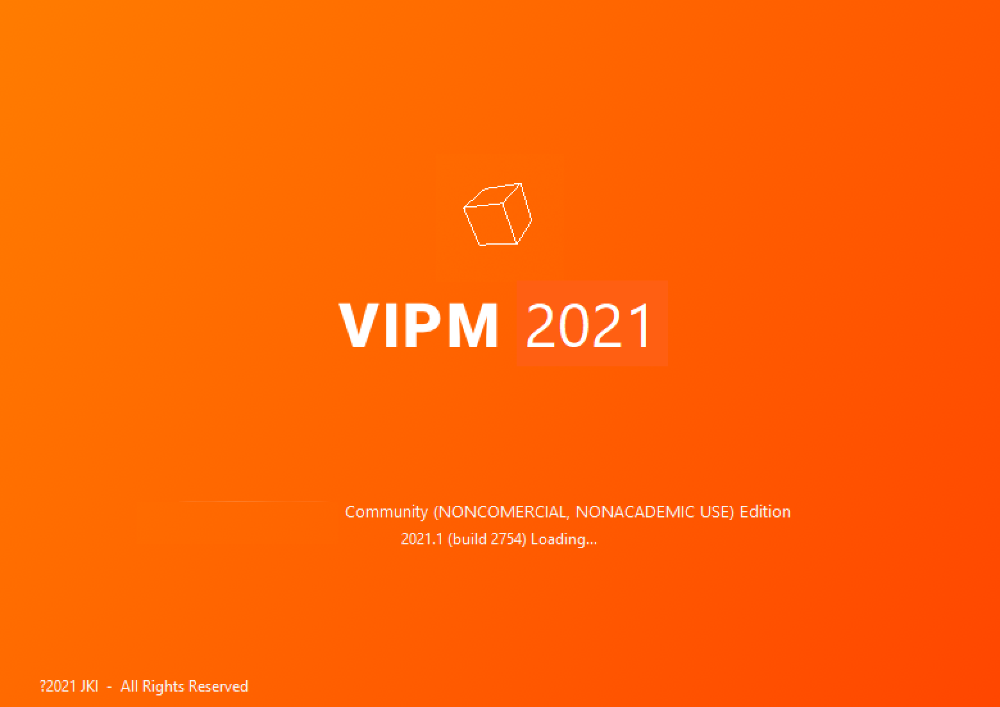
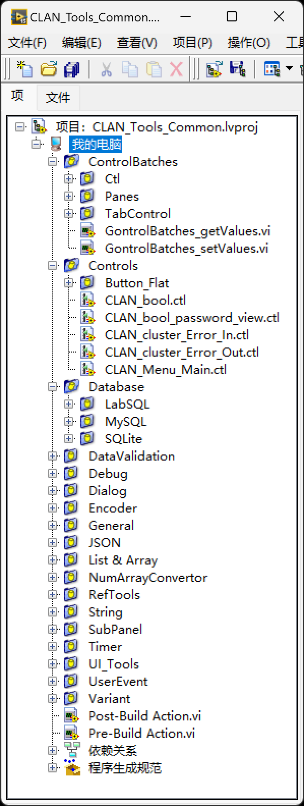
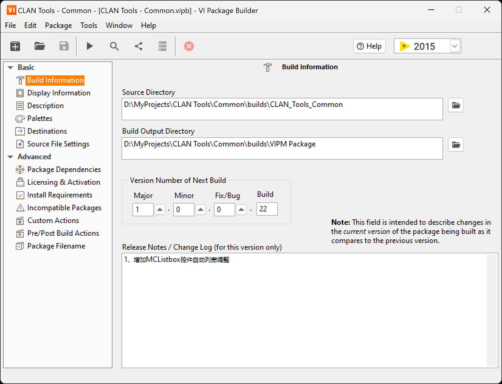

# LabVIEW VIPM 工具包打包教程

## 1.  VIPM简介

VI Package Manager（VIPM）是一个JKI组织开发的，对LabVIEW工具包进行搜索、创建、共享的包管理工具。对应LabVIEW开发工程师来说，到VIPM里搜索和安装工具包是一个必备技能，一些非常常用的工具包，如OpenG Library等都是通过VIPM进行发布和管理的。

本教程主要讲解如何利用VIPM来打包自己写的工具，以方便分享，或安装到其他电脑中进行使用。

## 2. 打开 Open VI Package Builder

通过左上角  图标，可以打开 `Open VI Package Builder` 窗口，如下图：

该界面可通过 `Create New` 按钮创建新的打包项目，也可通过 `Open Existing` 按钮打开已保存的打包项目文件（*.vipb）。同时也支持直接双击下方列表的近期项目来直接打开打包项目文件。

下面，本教程将以个人项目 `CLAN Tools - Common` 为例子，一步一步进行工具包打包操作。

## 3. CLAN Tools - Common项目打包

### 3.1. 项目结构

Common项目包含用于前面板的控件和用于后面板的函数模块，整个项目树结构如下：

### 3.2. 创建VI Package Builder项目文件

点击 `VI Package Builder` 中的 `Create New` 按钮后，如下图，填入对应的项目信息，并点击 `Finish` 按钮。

- `Source Directory` - 工具包源路径

- `Product Name` - 工具包名称

- `Company Name` - 公司/组织名称

### 3.3. 配置VI Package Builder项目文件

项目文件配置主界面：

基本配置：

- `Build Information` - 构建信息

- `Display Informtion` - 显示信息

- `Description` - 项目简介

- `Palettes` - 选板配置

- `Destinations` - 目标路径配置

- `Source File Settings` - 源文件配置

高级配置：

- `Package Dependencies` - 工具包依赖

- `Licensing & Activation` - 授权和激活

- `Install Requirements` - 安装环境要求

- `Incmpatible Packages` - 不兼容工具包配置

- `Custom Actions` - 安装/卸载的前/后操作

- `Pre/Post Build Actions` - 构建前/后操作

- `Package Filname` - 工具包文件名

#### 3.3.1. `Build Information` - 构建信息
